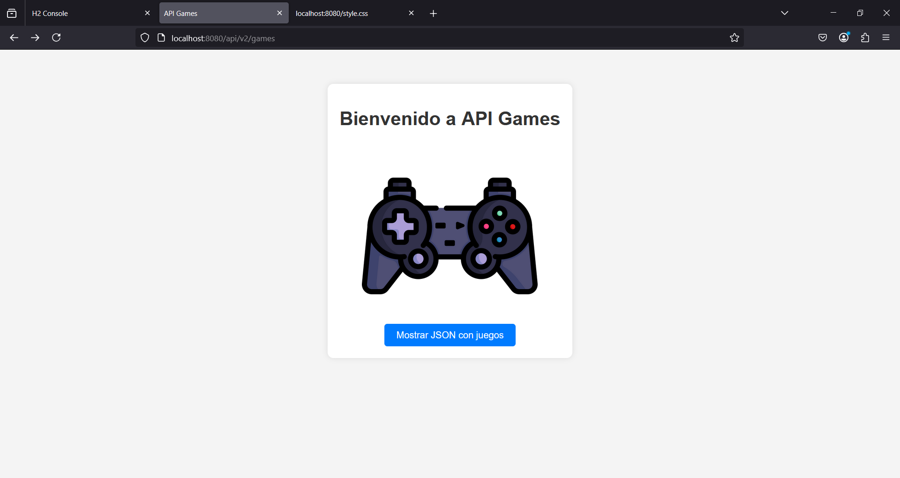
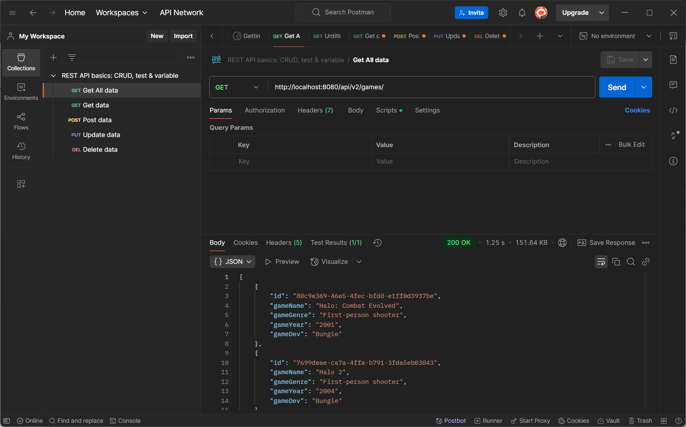
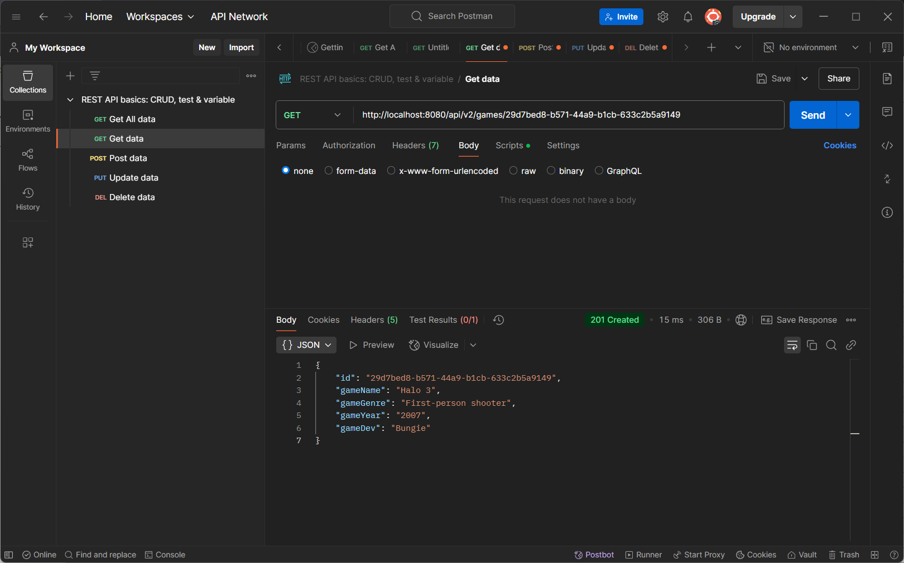
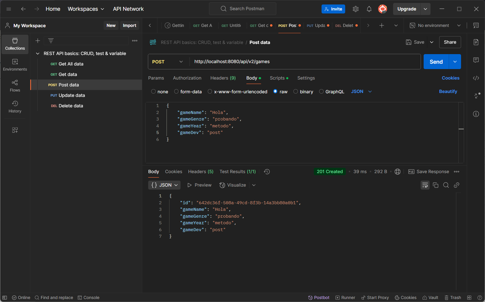
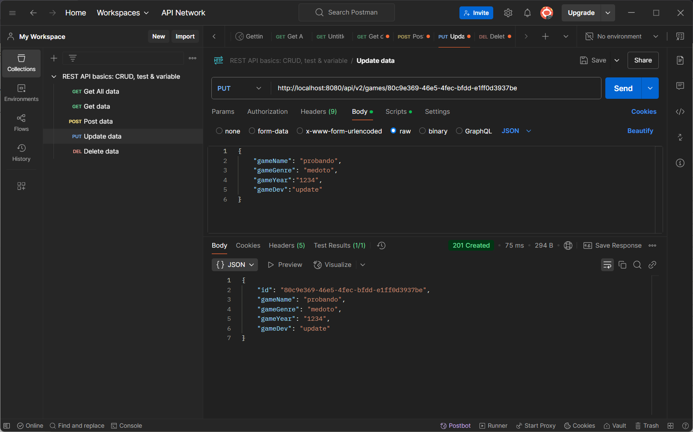
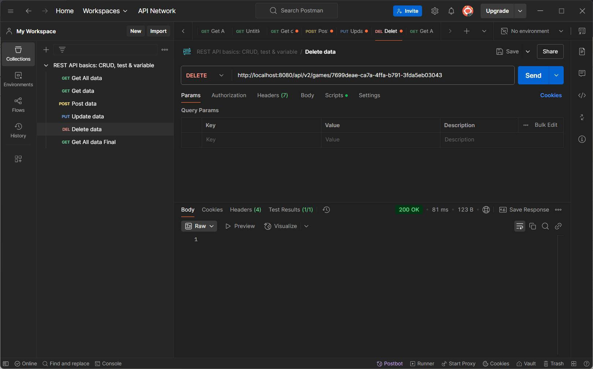
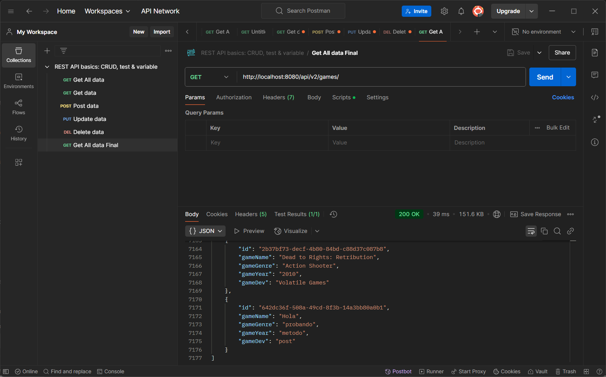
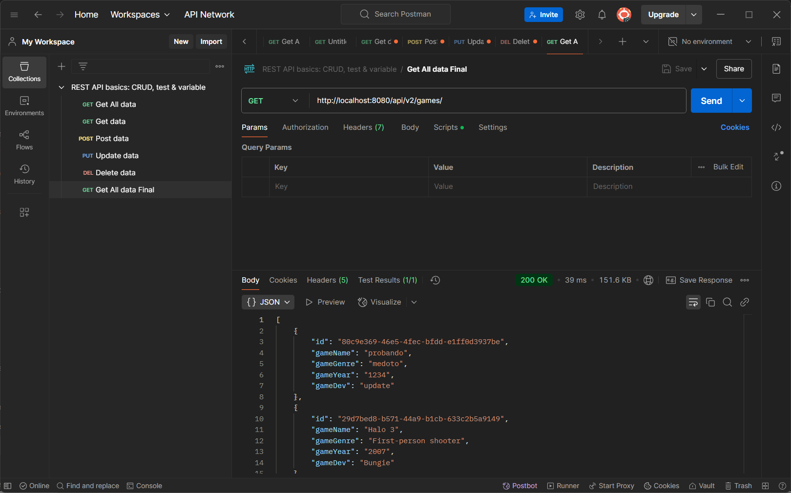

# Parcial 1 - Ingeniería Web

By: Nicolas Alvarado Soriano

Creación de una API CRUD con Spring Boot, que contenga mínimo 1000 registros (almacenados en un .json denominado "games.json" en la carpeta "src/main/resources") para posteriormente probarla con Postman

# Pruebas con Postman

Primera prueba con el método Get, en este caso se emplea el enlace para obtener todo el json.

Segunda prueba con el método Get, en este, tras ingresar a la DB por medio de H2 y obtener un UUID (cambbia con cada ejecución del proyecto) se realiza la busqueda de un item por su UUID.

Prueba con el méttodo Post, en e ta se crea un nuevo item, mas adelante se realiza otro get para verificar su creación.

Prueba con el método Update, en esta se editan los datos de un item ya creado, en este caso, el primer item, se verificará con otro get mas adelante.

Prueba con el método Delete, en esta se elimina por el UUID un item, en este caso se elimina "Halo 2", se verificará con el metodo get mas posteriormente.

Verificación del método Post, en esta se realiza un llamado al get de todos los items y se evidencia que se añadio correctamente el item al final de los elementos

Verificación de los métodos Delete y Update, en esta se evidencia como se eliminó "Halo 2" de los items y se actualizó los datos de "Halo: Combat Evolved" con lo enviado en las pruebas anteriroes

